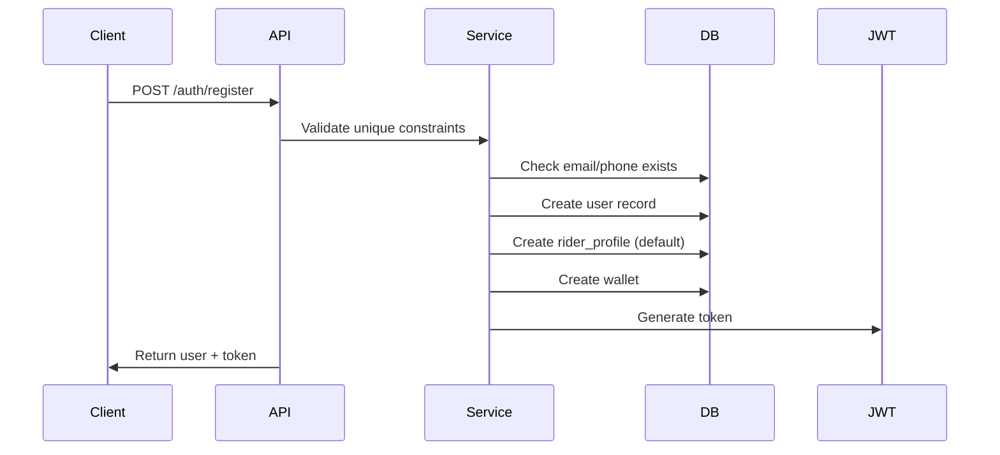
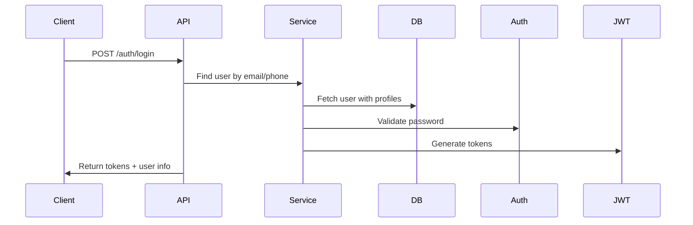

# Account Module - Architecture and Flow Documentation

## Overview

The Account module implements a multi-profile user system where a single user can have multiple roles (Rider, Driver, Admin) with role-specific data stored in separate profile tables. This document explains the architectural decisions and implementation details.

## Database Design

### User-Profile Relationship

The system uses a **one-to-one relationship** pattern with separate profile tables:

```
users (base table)
  ├── rider_profiles (1:0..1)
  ├── driver_profiles (1:0..1)
  ├── admin_profiles (1:0..1)
  └── wallets (1:0..1)
```

### Why This Design?

1. **Separation of Concerns**: Each role has distinct attributes that don't overlap
2. **Flexibility**: Users can have multiple roles simultaneously
3. **Performance**: Avoids sparse columns and allows role-specific indexing
4. **Scalability**: New roles can be added without modifying existing tables

## Authentication Flow

### Registration Process



### Login Process



## Multi-Profile Management

### Profile Creation Strategy

1. **Rider Profile**: Created automatically during registration
2. **Driver Profile**: Created when user applies to become driver (pending verification)
3. **Admin Profile**: Created only by system administrators

### Profile Switching

Users with multiple active profiles can switch between them:

```java
// Current implementation approach
1. User has both rider and driver profiles
2. JWT token includes current active role
3. Switch profile generates new token with different role claim
4. API endpoints check role from token for authorization
```

### Role Determination

The system determines a user's primary role using this hierarchy:
1. Admin (highest priority)
2. Active Driver
3. Rider (default)

## Verification System

### Student Verification Flow

```
User submits document → Create verification record (pending) → 
Admin reviews → Update status (approved/rejected) → 
Update user.student_verified flag
```

### Driver Verification Flow

```
User submits documents → Create driver_profile (pending) → 
Create verification records → Admin reviews documents → 
Approve licenses → Background check → 
Update driver_profile.status to 'active'
```

## Security Implementation

### JWT Token Structure

```json
{
  "sub": "user@example.com",
  "userId": 123,
  "role": "DRIVER",
  "iat": 1699000000,
  "exp": 1699003600
}
```

### Authorization Levels

1. **Public**: Registration, Login, Forgot Password
2. **Authenticated**: Profile operations, OTP requests
3. **Role-specific**: Driver operations require DRIVER role
4. **Admin-only**: User management, verification approvals

## Service Layer Architecture

### Separation of Concerns

```
Controller Layer (REST endpoints)
    ↓
Service Layer (Business logic)
    ↓
Repository Layer (Data access)
    ↓
Entity Layer (Domain models)
```

### Transaction Management

- All write operations use `@Transactional`
- Read operations use `@Transactional(readOnly = true)`
- Profile creation operations are atomic

## Error Handling Strategy

### Exception Hierarchy

```
DomainException (base)
├── NotFoundException
├── ConflictException
├── UnauthorizedException
└── ValidationException
```

### Error Response Format

```json
{
  "error": "CONFLICT",
  "message": "Email already exists",
  "trace_id": "550e8400-e29b-41d4-a716",
  "timestamp": "2025-09-13T09:00:00Z",
  "path": "/api/v1/auth/register"
}
```

## Configuration Management

### Environment-based Configuration

- **Development**: Relaxed security, verbose logging, Swagger enabled
- **Test**: In-memory database, minimal logging, fast execution
- **Production**: Strict security, optimized settings, monitoring enabled

### Feature Flags

```yaml
features:
  email-verification: true
  phone-verification: true
  student-verification: true
  driver-verification: true
```

## Performance Considerations

### Query Optimization

1. **Eager Loading**: Profile data loaded with user when needed
2. **Lazy Loading**: Related entities loaded on-demand
3. **Indexed Columns**: email, phone, license_number, status
4. **Connection Pooling**: HikariCP with optimized settings

### Caching Strategy

- JWT tokens cached in-memory
- OTP codes stored with TTL
- User profiles cacheable (not implemented yet)

## Future Enhancements

### Planned Improvements

1. **Redis Integration**: For OTP storage and session management
2. **Email/SMS Service**: Actual notification delivery
3. **File Storage**: S3 or similar for document uploads
4. **Audit Logging**: Track all user actions
5. **Rate Limiting**: More sophisticated per-user limits
6. **OAuth2 Support**: Social login integration

### Scalability Considerations

1. **Microservice Ready**: Clean boundaries for extraction
2. **Event-Driven**: Can publish domain events
3. **API Versioning**: Prepared for backward compatibility
4. **Database Sharding**: User ID-based partitioning possible

## Testing Strategy

### Test Coverage

- **Unit Tests**: Service methods, utilities
- **Integration Tests**: API endpoints, database operations
- **Security Tests**: Authentication, authorization
- **Validation Tests**: Input validation, business rules

### Test Data Management

- Flyway migrations for test data
- Builder pattern for test entities
- Testcontainers for database isolation

## Deployment Architecture

### Container Strategy

```dockerfile
FROM openjdk:17-slim
COPY target/app.jar app.jar
ENTRYPOINT ["java", "-jar", "/app.jar"]
```

### Health Monitoring

- `/actuator/health` - Application health
- `/actuator/metrics` - Performance metrics
- `/actuator/info` - Application information

## Conclusion

This architecture provides a robust, scalable foundation for the MSSUS account management system. The multi-profile design offers flexibility while maintaining clean separation of concerns. The implementation follows Spring Boot best practices and is ready for production deployment with proper configuration.
