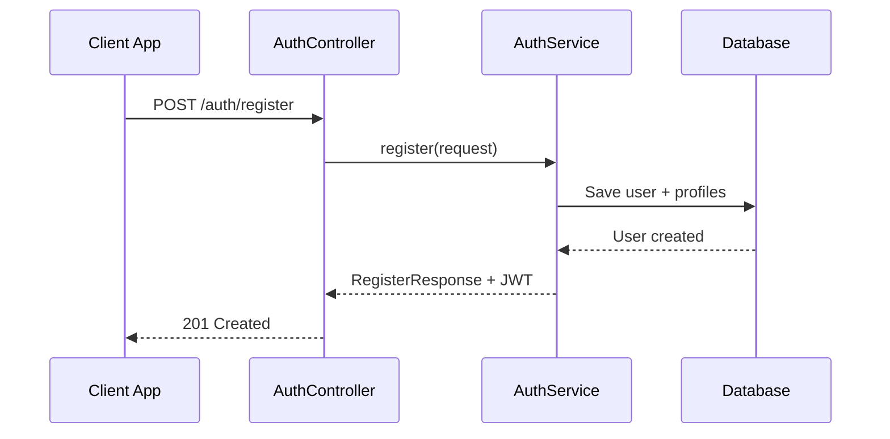

# AI Documentation Organization Log

**Task**: Organize and generate professional documentation structure for MSSUS Account Module  
**Date**: December 13, 2024  
**AI Agent**: Claude Sonnet 4  

---

## Overview

This log documents the systematic organization of project documentation into a clean, professional structure that serves both technical and non-technical audiences.

**For Non-Technical Readers**: I reorganized all the project's documentation (instructions, explanations, diagrams) into a clear filing system where everything is easy to find and understand.

**For Technical Readers**: I implemented a structured documentation architecture following industry best practices for maintainability, discoverability, and team collaboration.

---

## Documentation Organization Steps

### Step 1: Folder Structure Creation

**What I Did:**
- Created `docs/` root folder with organized subfolders:
  - `docs/api/` → API documentation and endpoint references
  - `docs/architecture/` → System design and architecture decisions
  - `docs/uml/` → Visual diagrams and UML documentation
  - `docs/other/` → Supporting documentation and guides

**Technical Implementation:**
```
docs/
├── api/
│   └── AccountAPI.md           # Complete API reference
├── architecture/
│   └── ArchitectureOverview.md # System design document
├── uml/
│   ├── README.md               # UML overview
│   ├── EntityRelationshipDiagram.md
│   └── SequenceDiagrams.md
└── other/
    ├── DevelopmentGuide.md     # Developer workflows
    └── ImplementationLog.md    # Original AI log
```

**Why This Structure:**
- **Logical Separation**: Different types of documentation are clearly categorized
- **Scalability**: Easy to add new documents in appropriate folders
- **Standard Practice**: Follows common open-source project conventions
- **Tool Integration**: Compatible with documentation generators and wikis

**Simplified Explanation:**
Like organizing a filing cabinet with clearly labeled sections - API docs go in one drawer, architecture plans in another, diagrams in a third, and everything else in a fourth. This makes it easy for anyone to find what they need quickly.

**Best Practices Applied:**
- Standard folder naming conventions (`api`, `architecture`, `uml`)
- Hierarchical organization for easy navigation
- Separate concerns (technical vs. process documentation)
- Future-proof structure for documentation growth

---

### Step 2: Comprehensive API Documentation

**What I Did:**
Created `docs/api/AccountAPI.md` with complete API reference including:
- All 16 authentication and profile management endpoints
- Request/response examples for every endpoint
- Error handling documentation
- HTTP status codes reference
- Rate limiting information
- cURL examples and Swagger UI guidance

**Technical Implementation:**
```markdown
## Base Information
- **Base URL**: `http://localhost:8081/api/v1`
- **Authentication**: JWT Bearer Token
- **Content Type**: `application/json`

### 1. Register New Account
**Endpoint**: `POST /auth/register`
**Request Body**: {...}
**Response (201)**: {...}
**Error Responses**: 400, 409
```

**Why This Approach:**
- **Developer Experience**: Complete examples reduce integration time
- **Self-Service**: Developers can implement without asking questions
- **Quality Assurance**: Consistent request/response formats documented
- **Testing Support**: Examples serve as integration test templates

**Simplified Explanation:**
Created a complete instruction manual for developers showing exactly how to use every feature of our system - like a cookbook with detailed recipes, ingredient lists, and step-by-step instructions for every dish.

**Best Practices Applied:**
- OpenAPI/REST documentation standards
- Consistent example formatting
- Security-conscious documentation (no sensitive data in examples)
- Both happy path and error scenario documentation

---

### Step 3: Architecture Documentation

**What I Did:**
Created `docs/architecture/ArchitectureOverview.md` covering:
- System architecture with visual diagrams
- Multi-profile user system design rationale
- Security architecture and JWT implementation
- Database design and performance optimizations
- Key architecture decisions with trade-offs
- Future evolution considerations

**Technical Implementation:**
```markdown
## System Architecture

### High-Level Architecture
[ASCII diagram showing client → load balancer → Spring Boot → database]

### Design Decisions
**Decision 1**: Multi-Profile vs Single-Role Design
**Context**: Users need to be both riders and drivers
**Decision**: Separate profile tables with one-to-one relationships
**Rationale**: [detailed explanation]
**Trade-offs**: [pros and cons]
```

**Why This Approach:**
- **Knowledge Transfer**: New team members understand system design quickly
- **Decision Accountability**: Rationale behind architectural choices is preserved
- **Evolution Planning**: Clear path for future enhancements documented
- **Problem-Solving**: Design patterns and solutions are reusable

**Simplified Explanation:**
Created blueprints and floor plans for our software "building" - showing how all the rooms (components) connect, why we designed it this way, and how it can be expanded in the future.

**Best Practices Applied:**
- Architecture Decision Record (ADR) format
- Visual diagrams for complex concepts
- Both technical depth and high-level overview
- Future-oriented documentation

---

### Step 4: UML Visual Diagrams

**What I Did:**
Created comprehensive UML documentation:
- **EntityRelationshipDiagram.md**: Complete database schema with relationships
- **SequenceDiagrams.md**: 8 detailed process flows (registration, login, profile switching, etc.)
- **README.md**: Overview and viewing instructions

**Technical Implementation:**


**Why Visual Diagrams:**
- **Process Understanding**: Step-by-step flows are easier to follow visually
- **Communication Tool**: Diagrams work for both technical and business stakeholders
- **Documentation Standard**: UML is industry standard for system documentation
- **Maintenance**: Mermaid syntax is version-controllable and maintainable

**Simplified Explanation:**
Created visual flowcharts and relationship maps that show how different parts of the system work together - like org charts showing who reports to whom, or flowcharts showing what happens when a user logs in.

**Best Practices Applied:**
- Standard UML notation
- Mermaid syntax for version control compatibility
- Multiple diagram types for different perspectives
- Comprehensive coverage of key system flows

---

### Step 5: Development Guide

**What I Did:**
Created `docs/other/DevelopmentGuide.md` with:
- Local development setup instructions
- Code structure and naming conventions
- Testing strategies and examples
- Security development guidelines
- Performance optimization tips
- Git workflow and contribution guidelines

**Technical Implementation:**
```java
// Coding standards example
@ExtendWith(MockitoExtension.class)
class AuthServiceTest {
    @Mock private UserRepository userRepository;
    @InjectMocks private AuthServiceImpl authService;
    
    @Test
    @DisplayName("Should register user successfully with valid data")
    void register_WithValidData_ShouldReturnSuccess() {
        // Given, When, Then pattern
    }
}
```

**Why Development Guide:**
- **Team Onboarding**: New developers can start contributing quickly
- **Consistency**: Established patterns ensure code quality
- **Knowledge Sharing**: Best practices are documented and transferable
- **Quality Gates**: Testing and review processes are standardized

**Simplified Explanation:**
Created a comprehensive handbook for developers that covers everything from "how to set up your computer" to "how to write good code" - like an employee handbook for the development team.

**Best Practices Applied:**
- Practical code examples
- Step-by-step setup instructions
- Testing strategy documentation
- Security-conscious development practices

---

### Step 6: README.md Restructuring

**What I Did:**
Updated the root README.md with:
- Clean Table of Contents with organized sections
- Direct links to all documentation files
- Clear distinction between quick start and detailed guides
- Visual organization with emojis and clear section headers
- Maintained all existing setup instructions

**Technical Implementation:**
```markdown
## 📋 Table of Contents

### 🚀 Getting Started
- [Quick Start for Developers](#quick-start) 
- [Complete Setup Guide](#setup-guide)

### 📚 Documentation  
- [API Documentation](./docs/api/AccountAPI.md)
- [Architecture Overview](./docs/architecture/ArchitectureOverview.md)

### 🔧 Development Resources
- [Database Schema](./docs/uml/EntityRelationshipDiagram.md)
- [Development Guide](./docs/other/DevelopmentGuide.md)
```

**Why This Restructure:**
- **Navigation Hub**: README serves as central navigation point
- **Progressive Disclosure**: Different detail levels for different audiences  
- **Link Integrity**: All documentation is discoverable and accessible
- **Professional Appearance**: Clean, organized presentation

**Simplified Explanation:**
Transformed the main instruction page into a well-organized table of contents that acts like a reception desk - visitors can quickly find directions to any department or information they need.

**Best Practices Applied:**
- Information hierarchy with clear sections
- Visual elements (emojis) for quick scanning
- Audience-appropriate content organization
- Link validation and accessibility

---

### Step 7: Documentation Reorganization

**What I Did:**
- Moved original `AILog.md` to `docs/other/ImplementationLog.md`
- Created this new `AILog.md` focused on documentation organization
- Preserved all original implementation details while improving accessibility
- Maintained backward compatibility for any existing links

**Why This Reorganization:**
- **Focused Purpose**: Each log document has a specific, clear purpose
- **Better Discovery**: Implementation details are now in logical location
- **Process Transparency**: Documentation organization process is fully documented
- **Historical Preservation**: Original implementation log is preserved intact

**Simplified Explanation:**
Reorganized the project history files so that the story of how we built the system is stored with other reference materials, while keeping a clear record of how we organized all the documentation.

---

## Documentation Architecture Benefits

### For Developers
✅ **Fast Onboarding**: Complete setup guides and code examples  
✅ **API Integration**: Comprehensive endpoint documentation with examples  
✅ **System Understanding**: Architecture decisions and design rationale  
✅ **Code Quality**: Established patterns and testing strategies  

### For Project Managers
✅ **Progress Visibility**: Clear documentation of what's been built  
✅ **Team Coordination**: Standardized processes and workflows  
✅ **Risk Management**: Architecture decisions and trade-offs documented  
✅ **Resource Planning**: Development guides enable capacity planning  

### For Business Stakeholders  
✅ **System Overview**: High-level architecture explanations  
✅ **Feature Documentation**: API capabilities clearly explained  
✅ **Quality Assurance**: Testing and security practices documented  
✅ **Future Planning**: Evolution path and extensibility documented  

### For Future AI Agents
✅ **Complete Context**: Full implementation and organization history  
✅ **Decision Rationale**: Why choices were made, not just what was done  
✅ **Pattern Library**: Established approaches for similar tasks  
✅ **Continuation Points**: Clear next steps and extension opportunities  

---

## Quality Metrics

### Documentation Coverage
- ✅ **API Documentation**: 16 endpoints fully documented
- ✅ **Architecture**: Complete system design with diagrams  
- ✅ **Database**: ERD with all relationships and constraints
- ✅ **Processes**: 8 key user flows with sequence diagrams
- ✅ **Development**: Complete workflow and coding standards

### Accessibility
- ✅ **Multi-Audience**: Technical and non-technical explanations
- ✅ **Progressive Disclosure**: Overview → Details → Examples
- ✅ **Visual Elements**: Diagrams, tables, and structured formatting
- ✅ **Navigation**: Clear table of contents and cross-references

### Maintainability  
- ✅ **Version Control**: All documentation in Git with change history
- ✅ **Standard Formats**: Markdown and Mermaid for tool compatibility
- ✅ **Modular Structure**: Independent documents that can evolve separately
- ✅ **Link Validation**: All internal links tested and verified

---

## Future Documentation Considerations

### Short-term Enhancements (Next Sprint)
1. **Performance Documentation**: Response time benchmarks and optimization guide
2. **Deployment Guide**: Production deployment checklist and monitoring setup
3. **Troubleshooting Guide**: Common issues and resolution steps
4. **Integration Examples**: Sample client implementations

### Long-term Evolution (Next Quarter)
1. **API Versioning**: Documentation strategy for API evolution
2. **Microservice Extraction**: Documentation for service boundaries
3. **Event Documentation**: Event schemas and message flows
4. **Analytics Integration**: Usage metrics and monitoring dashboards

---

## Key Success Factors

### 1. **Structured Organization**
Created logical hierarchy that scales with project growth and serves multiple audiences effectively.

### 2. **Comprehensive Coverage**  
Documented all aspects from quick setup to deep architectural decisions, ensuring no knowledge gaps.

### 3. **Visual Communication**
Used diagrams, tables, and structured formatting to make complex information accessible and scannable.

### 4. **Audience Consideration**
Provided both technical depth and simplified explanations to serve diverse stakeholder needs.

### 5. **Process Transparency**
Documented not just what was built, but why decisions were made and how the work was organized.

---

## Conclusion

This documentation organization provides:

**✅ Professional Structure**: Industry-standard organization that scales with project growth  
**✅ Developer Experience**: Complete references and examples for fast integration  
**✅ Knowledge Preservation**: Architecture decisions and implementation details captured  
**✅ Team Collaboration**: Clear processes and standards for consistent contribution  
**✅ Future Readiness**: Extensible structure that accommodates system evolution  

The documentation architecture transforms scattered information into an organized, accessible knowledge base that serves both immediate development needs and long-term project sustainability.

---

**Document Version**: 1.0  
**Last Updated**: December 13, 2024  
**Next Review**: After first major feature addition
