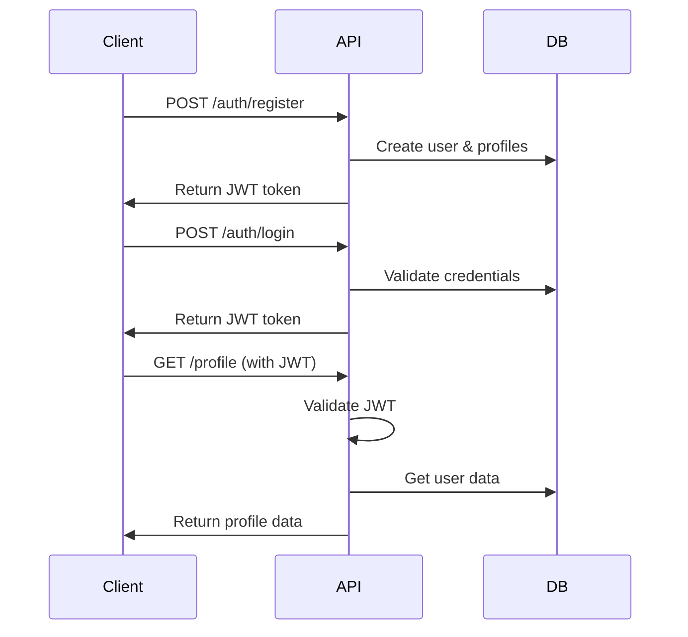

# Account API Documentation

This document provides comprehensive API documentation for the Account module of the Motorbike Sharing System for University Students (MSSUS). The API handles user authentication, profile management, and account operations.

## Base Information

- **Base URL**: `http://localhost:8081/api/v1`
- **Authentication**: JWT Bearer Token
- **Content Type**: `application/json`
- **API Version**: v1

---

## Authentication Endpoints

### 1. Register New Account

**Endpoint**: `POST /auth/register`

**Description**: Create a new user account in the system.

**Request Body**:
```json
{
  "fullName": "Nguyen Van A",
  "email": "student@university.edu.vn",
  "phone": "0901234567",
  "password": "SecurePassword123",
  "confirmPassword": "SecurePassword123",
  "studentId": "SE123456",
  "dateOfBirth": "2000-01-15",
  "gender": "MALE",
  "acceptTerms": true
}
```

**Response (201 Created)**:
```json
{
  "user": {
    "userId": 1,
    "fullName": "Nguyen Van A",
    "email": "student@university.edu.vn",
    "phone": "0901234567",
    "studentId": "SE123456",
    "userType": "student",
    "isActive": true,
    "emailVerified": false,
    "phoneVerified": false,
    "profilePhotoUrl": null,
    "createdAt": "2024-12-13T10:30:00Z"
  },
  "token": "eyJhbGciOiJIUzI1NiIsInR5cCI6IkpXVCJ9...",
  "refreshToken": "eyJhbGciOiJIUzI1NiIsInR5cCI6IkpXVCJ9...",
  "expiresIn": 3600
}
```

**Error Responses**:
- `400 Bad Request`: Invalid input data
- `409 Conflict`: Email or phone already exists

---

### 2. User Login

**Endpoint**: `POST /auth/login`

**Description**: Authenticate user and receive access tokens.

**Request Body**:
```json
{
  "email": "student@university.edu.vn",
  "password": "SecurePassword123"
}
```

**Response (200 OK)**:
```json
{
  "user": {
    "userId": 1,
    "fullName": "Nguyen Van A",
    "email": "student@university.edu.vn",
    "currentProfile": "rider",
    "availableProfiles": ["rider", "driver"],
    "profilePhotoUrl": null
  },
  "token": "eyJhbGciOiJIUzI1NiIsInR5cCI6IkpXVCJ9...",
  "refreshToken": "eyJhbGciOiJIUzI1NiIsInR5cCI6IkpXVCJ9...",
  "expiresIn": 3600
}
```

**Error Responses**:
- `400 Bad Request`: Missing credentials
- `401 Unauthorized`: Invalid credentials
- `423 Locked`: Account locked due to multiple failed attempts

---

### 3. Logout

**Endpoint**: `POST /auth/logout`

**Description**: Invalidate user session and tokens.

**Headers**: `Authorization: Bearer {token}`

**Response (200 OK)**:
```json
{
  "message": "Logged out successfully"
}
```

---

### 4. Refresh Token

**Endpoint**: `POST /auth/refresh`

**Description**: Get new access token using refresh token.

**Request Body**:
```json
{
  "refreshToken": "eyJhbGciOiJIUzI1NiIsInR5cCI6IkpXVCJ9..."
}
```

**Response (200 OK)**:
```json
{
  "token": "eyJhbGciOiJIUzI1NiIsInR5cCI6IkpXVCJ9...",
  "refreshToken": "eyJhbGciOiJIUzI1NiIsInR5cCI6IkpXVCJ9...",
  "expiresIn": 3600
}
```

---

## Profile Management Endpoints

### 5. Get User Profile

**Endpoint**: `GET /profile`

**Description**: Retrieve current user's complete profile information.

**Headers**: `Authorization: Bearer {token}`

**Response (200 OK)**:
```json
{
  "user": {
    "userId": 1,
    "fullName": "Nguyen Van A",
    "email": "student@university.edu.vn",
    "phone": "0901234567",
    "studentId": "SE123456",
    "dateOfBirth": "2000-01-15",
    "gender": "MALE",
    "userType": "student",
    "isActive": true,
    "emailVerified": true,
    "phoneVerified": false,
    "profilePhotoUrl": "https://api.example.com/files/profile_photos/user1.jpg",
    "currentProfile": "rider",
    "createdAt": "2024-12-13T10:30:00Z",
    "updatedAt": "2024-12-13T15:45:00Z"
  },
  "profiles": {
    "rider": {
      "riderId": 1,
      "emergencyContact": "0909876543",
      "ratingAvg": 4.5,
      "totalRides": 15,
      "totalSpent": 450000,
      "preferredPaymentMethod": "wallet"
    },
    "driver": {
      "driverId": 1,
      "licenseNumber": "123456789",
      "licenseVerifiedAt": "2024-12-10T09:00:00Z",
      "status": "active",
      "ratingAvg": 4.8,
      "totalSharedRides": 28,
      "totalEarned": 1200000,
      "isAvailable": true,
      "maxPassengers": 1
    }
  },
  "wallet": {
    "walletId": 1,
    "cachedBalance": 250000,
    "pendingBalance": 0,
    "totalToppedUp": 500000,
    "totalSpent": 250000,
    "isActive": true
  }
}
```

---

### 6. Update Profile

**Endpoint**: `PUT /profile`

**Description**: Update user's basic profile information.

**Headers**: `Authorization: Bearer {token}`

**Request Body**:
```json
{
  "fullName": "Nguyen Van An",
  "phone": "0901234568",
  "dateOfBirth": "2000-01-15",
  "gender": "MALE"
}
```

**Response (200 OK)**:
```json
{
  "message": "Profile updated successfully",
  "user": {
    "userId": 1,
    "fullName": "Nguyen Van An",
    "email": "student@university.edu.vn",
    "phone": "0901234568",
    "updatedAt": "2024-12-13T16:00:00Z"
  }
}
```

---

### 7. Switch Profile

**Endpoint**: `POST /profile/switch`

**Description**: Switch between rider, driver, or admin profiles.

**Headers**: `Authorization: Bearer {token}`

**Request Body**:
```json
{
  "profileType": "driver"
}
```

**Response (200 OK)**:
```json
{
  "message": "Profile switched successfully",
  "currentProfile": "driver",
  "token": "eyJhbGciOiJIUzI1NiIsInR5cCI6IkpXVCJ9..."
}
```

---

## Password Management

### 8. Change Password

**Endpoint**: `PUT /auth/change-password`

**Description**: Change user's password (requires current password).

**Headers**: `Authorization: Bearer {token}`

**Request Body**:
```json
{
  "currentPassword": "OldPassword123",
  "newPassword": "NewSecurePassword456",
  "confirmPassword": "NewSecurePassword456"
}
```

**Response (200 OK)**:
```json
{
  "message": "Password changed successfully"
}
```

---

### 9. Forgot Password

**Endpoint**: `POST /auth/forgot-password`

**Description**: Request password reset via email.

**Request Body**:
```json
{
  "email": "student@university.edu.vn"
}
```

**Response (200 OK)**:
```json
{
  "message": "Password reset instructions sent to your email",
  "otpSent": true
}
```

---

### 10. Reset Password

**Endpoint**: `POST /auth/reset-password`

**Description**: Reset password using OTP from email.

**Request Body**:
```json
{
  "email": "student@university.edu.vn",
  "otp": "123456",
  "newPassword": "NewPassword789",
  "confirmPassword": "NewPassword789"
}
```

**Response (200 OK)**:
```json
{
  "message": "Password reset successfully"
}
```

---

## Verification Endpoints

### 11. Request OTP

**Endpoint**: `POST /auth/otp/request`

**Description**: Request OTP for email or phone verification.

**Headers**: `Authorization: Bearer {token}`

**Request Body**:
```json
{
  "type": "email",
  "purpose": "verification"
}
```

**Response (200 OK)**:
```json
{
  "message": "OTP sent successfully",
  "type": "email",
  "expiresIn": 300,
  "canResendIn": 60
}
```

---

### 12. Submit OTP

**Endpoint**: `POST /auth/otp/submit`

**Description**: Submit OTP for verification.

**Headers**: `Authorization: Bearer {token}`

**Request Body**:
```json
{
  "type": "email",
  "otp": "123456",
  "purpose": "verification"
}
```

**Response (200 OK)**:
```json
{
  "message": "Email verified successfully",
  "verified": true
}
```

---

## Driver-Specific Endpoints

### 13. Submit Driver Verification

**Endpoint**: `POST /profile/driver/verification`

**Description**: Submit documents for driver verification.

**Headers**: `Authorization: Bearer {token}`

**Request Body**:
```json
{
  "licenseNumber": "123456789",
  "licensePhotoUrl": "https://api.example.com/files/licenses/license1.jpg",
  "identityPhotoUrl": "https://api.example.com/files/identity/id1.jpg",
  "vehicleRegistrationUrl": "https://api.example.com/files/vehicles/reg1.jpg"
}
```

**Response (201 Created)**:
```json
{
  "message": "Documents submitted successfully",
  "verificationId": "ver_123456",
  "status": "pending",
  "estimatedReviewTime": "2-3 business days"
}
```

---

### 14. Get Verification Status

**Endpoint**: `GET /profile/driver/verification`

**Description**: Check driver verification status.

**Headers**: `Authorization: Bearer {token}`

**Response (200 OK)**:
```json
{
  "verifications": [
    {
      "verificationId": "ver_123456",
      "type": "driver_license",
      "status": "approved",
      "documentUrl": "https://api.example.com/files/licenses/license1.jpg",
      "verifiedAt": "2024-12-10T09:00:00Z",
      "verifiedBy": "admin_001"
    }
  ]
}
```

---

## Admin Endpoints (Admin Role Required)

### 15. Get All Users

**Endpoint**: `GET /admin/users`

**Description**: Retrieve paginated list of all users.

**Headers**: `Authorization: Bearer {admin_token}`

**Query Parameters**:
- `page`: Page number (default: 0)
- `size`: Page size (default: 20)
- `search`: Search term
- `status`: User status filter
- `sort`: Sort field and direction

**Response (200 OK)**:
```json
{
  "content": [
    {
      "userId": 1,
      "fullName": "Nguyen Van A",
      "email": "student@university.edu.vn",
      "phone": "0901234567",
      "userType": "student",
      "isActive": true,
      "emailVerified": true,
      "createdAt": "2024-12-13T10:30:00Z"
    }
  ],
  "pageable": {
    "page": 0,
    "size": 20,
    "sort": "createdAt,desc"
  },
  "totalElements": 150,
  "totalPages": 8,
  "first": true,
  "last": false
}
```

---

### 16. Update User Account

**Endpoint**: `PUT /admin/users/{userId}`

**Description**: Admin update of user account.

**Headers**: `Authorization: Bearer {admin_token}`

**Request Body**:
```json
{
  "isActive": false,
  "emailVerified": true,
  "phoneVerified": true,
  "userType": "student"
}
```

**Response (200 OK)**:
```json
{
  "message": "User account updated successfully",
  "user": {
    "userId": 1,
    "isActive": false,
    "updatedAt": "2024-12-13T16:30:00Z"
  }
}
```

---

## Error Response Format

All error responses follow this standard format:

```json
{
  "error": "VALIDATION_ERROR",
  "message": "Invalid input data",
  "traceId": "abc123-def456-ghi789",
  "timestamp": "2024-12-13T16:00:00Z",
  "path": "/api/v1/auth/register",
  "details": [
    {
      "field": "email",
      "message": "Email format is invalid"
    }
  ]
}
```

---

## HTTP Status Codes

| Code | Meaning | Description |
|------|---------|-------------|
| 200 | OK | Request successful |
| 201 | Created | Resource created successfully |
| 400 | Bad Request | Invalid input data |
| 401 | Unauthorized | Authentication required or failed |
| 403 | Forbidden | Access denied |
| 404 | Not Found | Resource not found |
| 409 | Conflict | Resource already exists |
| 422 | Unprocessable Entity | Validation failed |
| 423 | Locked | Account locked |
| 429 | Too Many Requests | Rate limit exceeded |
| 500 | Internal Server Error | Server error |

---

## Rate Limiting

API endpoints have rate limiting applied:

- **Authentication endpoints**: 5 requests per minute per IP
- **Profile endpoints**: 30 requests per minute per user
- **Admin endpoints**: 100 requests per minute per admin

Rate limit headers are included in responses:
- `X-RateLimit-Limit`: Request limit per window
- `X-RateLimit-Remaining`: Remaining requests
- `X-RateLimit-Reset`: Window reset time

---

## Testing the API

### Using cURL

```bash
# Register new user
curl -X POST http://localhost:8081/api/v1/auth/register \
  -H "Content-Type: application/json" \
  -d '{
    "fullName": "Test User",
    "email": "test@university.edu.vn",
    "phone": "0901234567",
    "password": "Password123",
    "confirmPassword": "Password123",
    "studentId": "SE123456",
    "acceptTerms": true
  }'

# Login
curl -X POST http://localhost:8081/api/v1/auth/login \
  -H "Content-Type: application/json" \
  -d '{
    "email": "test@university.edu.vn",
    "password": "Password123"
  }'

# Get profile (replace TOKEN with actual JWT)
curl -X GET http://localhost:8081/api/v1/profile \
  -H "Authorization: Bearer TOKEN"
```

### Using Swagger UI

Visit `http://localhost:8081/swagger-ui.html` for interactive API testing.

---

## Authentication Flow



---

## Notes for Developers

### Security Considerations
- All passwords are hashed using BCrypt
- JWT tokens expire in 1 hour by default
- Refresh tokens are valid for 7 days
- Rate limiting prevents brute force attacks
- Input validation prevents injection attacks

### Performance Tips
- Use pagination for list endpoints
- Profile data is cached for 5 minutes
- Database indexes are optimized for common queries
- JOIN FETCH queries prevent N+1 problems

### Testing
- Unit tests cover all service methods
- Integration tests verify API endpoints
- Security tests validate authentication flows
- Performance tests ensure response time requirements
