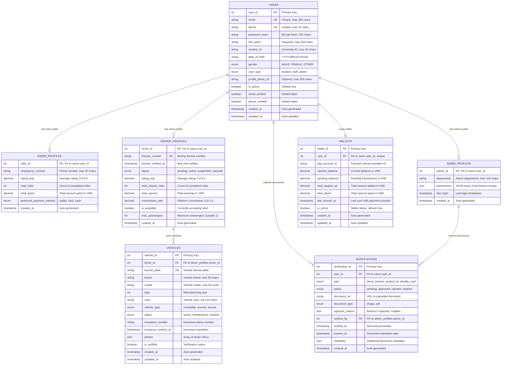
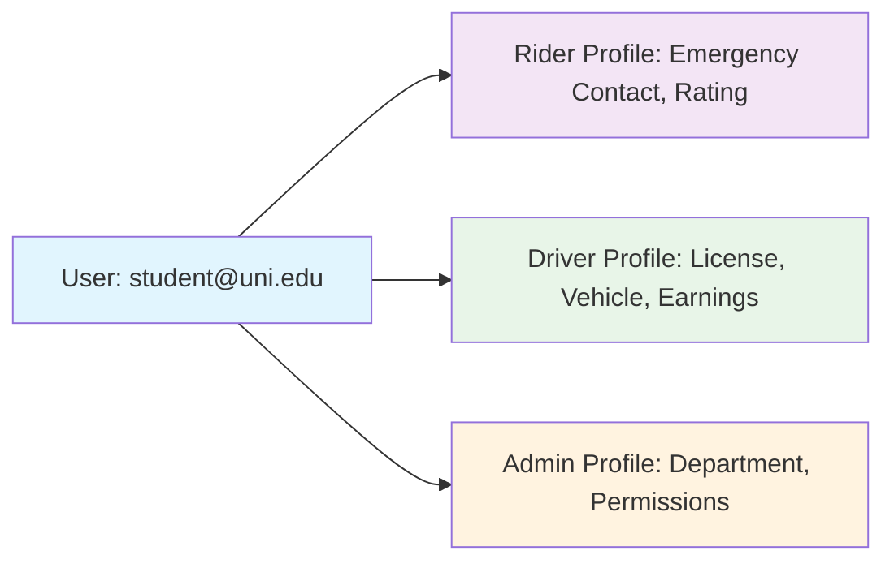
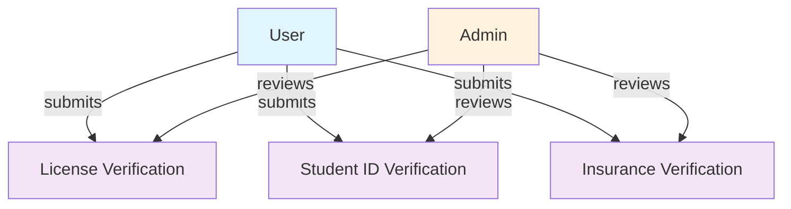
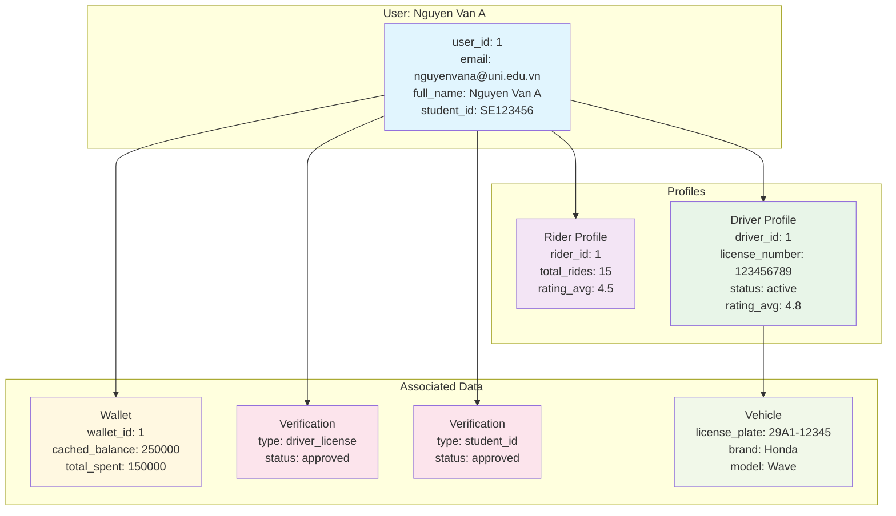
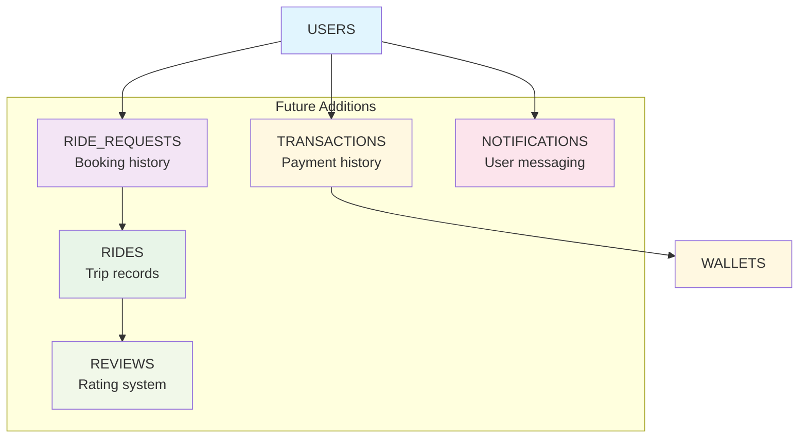

# Entity Relationship Diagram

This document shows the database schema and relationships for the MSSUS Account module.

## Overview

**For Non-Technical Readers**: This diagram shows how different types of information are stored and connected in our database. Think of it like a filing system where each box represents a type of information (like "User Information" or "Payment Records"), and the lines show how they're related.

**For Technical Readers**: This ERD represents the normalized database schema with proper foreign key relationships, constraints, and indexes optimized for the multi-profile user system.

---

## Complete Entity Relationship Diagram



---

## Relationship Details

### User-Profile Relationships

**One-to-One Optional Relationships**:
- `USERS` → `RIDER_PROFILES`: A user may have a rider profile
- `USERS` → `DRIVER_PROFILES`: A user may have a driver profile  
- `USERS` → `ADMIN_PROFILES`: A user may have an admin profile



**Business Logic**:
- Users start with no profiles (registration creates them)
- Rider profile created automatically on registration
- Driver profile created when user applies to be driver
- Admin profile created by system administrators

### Wallet Relationships

**One-to-One Mandatory Relationship**:
- `USERS` → `WALLETS`: Every user has exactly one wallet


### Verification Relationships

**Many-to-Many through Verification Entity**:
- `USERS` → `VERIFICATIONS`: Users can submit multiple documents
- `ADMIN_PROFILES` → `VERIFICATIONS`: Admins can verify multiple documents



---

## Database Constraints and Indexes

### Primary Keys and Foreign Keys

```sql
-- Primary Keys
ALTER TABLE users ADD CONSTRAINT pk_users PRIMARY KEY (user_id);
ALTER TABLE rider_profiles ADD CONSTRAINT pk_rider_profiles PRIMARY KEY (rider_id);
ALTER TABLE driver_profiles ADD CONSTRAINT pk_driver_profiles PRIMARY KEY (driver_id);
ALTER TABLE admin_profiles ADD CONSTRAINT pk_admin_profiles PRIMARY KEY (admin_id);
ALTER TABLE wallets ADD CONSTRAINT pk_wallets PRIMARY KEY (wallet_id);
ALTER TABLE verifications ADD CONSTRAINT pk_verifications PRIMARY KEY (verification_id);
ALTER TABLE vehicles ADD CONSTRAINT pk_vehicles PRIMARY KEY (vehicle_id);

-- Foreign Key Constraints  
ALTER TABLE rider_profiles ADD CONSTRAINT fk_rider_user 
    FOREIGN KEY (rider_id) REFERENCES users(user_id) ON DELETE CASCADE;

ALTER TABLE driver_profiles ADD CONSTRAINT fk_driver_user 
    FOREIGN KEY (driver_id) REFERENCES users(user_id) ON DELETE CASCADE;

ALTER TABLE admin_profiles ADD CONSTRAINT fk_admin_user 
    FOREIGN KEY (admin_id) REFERENCES users(user_id) ON DELETE CASCADE;

ALTER TABLE wallets ADD CONSTRAINT fk_wallet_user 
    FOREIGN KEY (user_id) REFERENCES users(user_id) ON DELETE CASCADE;

ALTER TABLE verifications ADD CONSTRAINT fk_verification_user 
    FOREIGN KEY (user_id) REFERENCES users(user_id) ON DELETE CASCADE;

ALTER TABLE verifications ADD CONSTRAINT fk_verification_admin 
    FOREIGN KEY (verified_by) REFERENCES admin_profiles(admin_id);

ALTER TABLE vehicles ADD CONSTRAINT fk_vehicle_driver 
    FOREIGN KEY (driver_id) REFERENCES driver_profiles(driver_id) ON DELETE CASCADE;
```

### Unique Constraints

```sql
-- User unique constraints
ALTER TABLE users ADD CONSTRAINT uk_users_email UNIQUE (email);
ALTER TABLE users ADD CONSTRAINT uk_users_phone UNIQUE (phone);

-- Driver unique constraints
ALTER TABLE driver_profiles ADD CONSTRAINT uk_driver_license UNIQUE (license_number);

-- Vehicle unique constraints  
ALTER TABLE vehicles ADD CONSTRAINT uk_vehicle_license UNIQUE (license_plate);

-- Wallet unique constraints
ALTER TABLE wallets ADD CONSTRAINT uk_wallet_user UNIQUE (user_id);
```

### Performance Indexes

```sql
-- User lookup indexes
CREATE INDEX idx_users_email ON users(email);
CREATE INDEX idx_users_phone ON users(phone);
CREATE INDEX idx_users_active ON users(is_active) WHERE is_active = true;
CREATE INDEX idx_users_type ON users(user_type);

-- Profile lookup indexes
CREATE INDEX idx_rider_profiles_rating ON rider_profiles(rating_avg DESC);
CREATE INDEX idx_driver_profiles_status ON driver_profiles(status);  
CREATE INDEX idx_driver_profiles_available ON driver_profiles(is_available) WHERE is_available = true;
CREATE INDEX idx_driver_profiles_rating ON driver_profiles(rating_avg DESC);

-- Verification indexes
CREATE INDEX idx_verifications_user_type ON verifications(user_id, type);
CREATE INDEX idx_verifications_status ON verifications(status);
CREATE INDEX idx_verifications_created ON verifications(created_at DESC);

-- Vehicle indexes
CREATE INDEX idx_vehicles_driver ON vehicles(driver_id);
CREATE INDEX idx_vehicles_status ON vehicles(status);
CREATE INDEX idx_vehicles_type ON vehicles(vehicle_type);

-- Wallet indexes
CREATE INDEX idx_wallets_active ON wallets(is_active) WHERE is_active = true;
CREATE INDEX idx_wallets_last_sync ON wallets(last_synced_at);
```

---

## Data Types and Validation

### Enumeration Values

```sql
-- User enums
CREATE TYPE gender_enum AS ENUM ('MALE', 'FEMALE', 'OTHER');
CREATE TYPE user_type_enum AS ENUM ('student', 'staff', 'admin');

-- Profile enums
CREATE TYPE payment_method_enum AS ENUM ('wallet', 'card', 'cash');
CREATE TYPE driver_status_enum AS ENUM ('pending', 'active', 'suspended', 'rejected');

-- Verification enums  
CREATE TYPE verification_type_enum AS ENUM ('driver_license', 'student_id', 'identity_card', 'insurance');
CREATE TYPE verification_status_enum AS ENUM ('pending', 'approved', 'rejected', 'expired');
CREATE TYPE document_type_enum AS ENUM ('image', 'pdf');

-- Vehicle enums
CREATE TYPE vehicle_type_enum AS ENUM ('motorbike', 'scooter', 'bicycle');
CREATE TYPE vehicle_status_enum AS ENUM ('active', 'maintenance', 'inactive');
```

### Data Validation Rules

| Field | Validation Rule | Example |
|-------|----------------|---------|
| **email** | Valid email format, university domain | `student@university.edu.vn` |
| **phone** | Vietnamese mobile format | `0901234567` or `+84901234567` |
| **password** | Min 8 chars, uppercase, lowercase, number | `SecurePass123` |
| **student_id** | University ID format | `SE123456` |
| **license_number** | Vietnamese license format | `123456789` |
| **license_plate** | Vietnamese plate format | `29A1-12345` |
| **rating_avg** | Decimal 0.0-5.0, 1 decimal place | `4.5` |
| **amounts** | Positive decimal, max 2 decimal places | `150000.50` |

---

## Sample Data Relationships

### Example User with Multiple Profiles



---

## Evolution and Migration Strategy

### Current State (v1.0)
- Basic user profiles with multi-role support
- Simple verification workflow
- Single vehicle per driver

### Planned Evolution (v2.0)


### Migration Considerations

**Backward Compatibility**:
- All existing foreign keys maintained
- New tables use separate migration files
- No breaking changes to existing APIs

**Performance Impact**:
- New indexes added for query optimization
- Partitioning strategy for high-volume tables (rides, transactions)
- Archive strategy for historical data

**Data Integrity**:
- Cascading delete rules preserve referential integrity
- Soft delete pattern for audit trail requirements
- Transaction boundaries for multi-table operations

---

## Summary

This ERD represents a normalized, scalable database design that:

**✅ Supports Business Requirements**:
- Multi-profile users (rider + driver simultaneously)
- Document verification workflow
- Wallet and payment integration
- Vehicle management for drivers

**✅ Ensures Data Integrity**:
- Proper foreign key constraints
- Unique constraints prevent duplicates  
- Check constraints validate business rules
- Cascade rules maintain consistency

**✅ Optimizes Performance**:
- Strategic indexing for common queries
- Normalized structure reduces redundancy
- Pagination-friendly design
- Query optimization through proper relationships

**✅ Enables Future Growth**:
- Clean extension points for new features
- Migration-friendly structure
- Scalable to handle increased load
- Microservice extraction readiness
