# Sequence Diagrams

This document shows the step-by-step processes and interactions in the MSSUS Account module.

## Overview

**For Non-Technical Readers**: These diagrams show the sequence of steps that happen when users perform actions like registering, logging in, or updating their profile. Think of them as detailed workflows showing who does what and when.

**For Technical Readers**: These UML sequence diagrams illustrate the interaction flows between system components, showing message passing, timing, and control flow for key use cases.

---

## 1. User Registration Flow

### Complete Registration Process

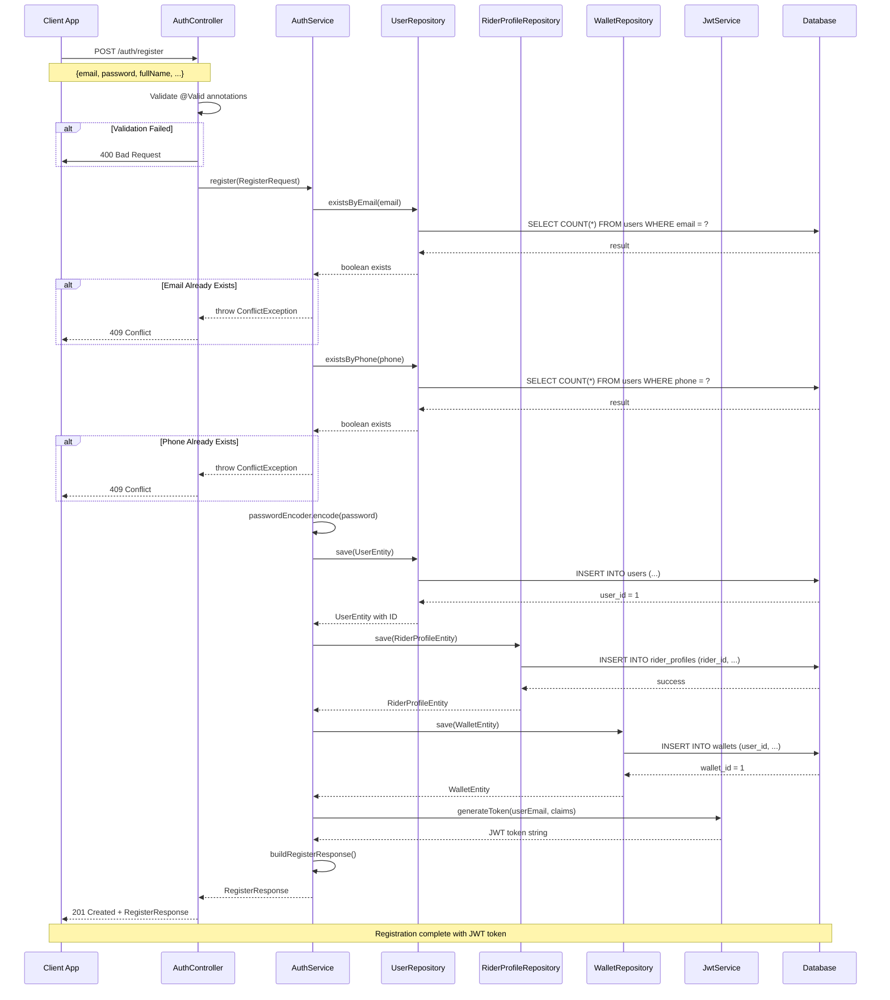

### Registration Error Handling

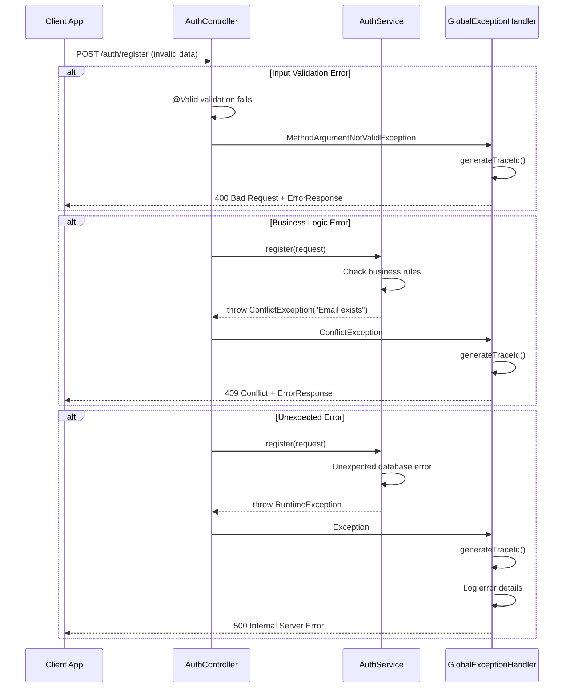

---

## 2. User Login Flow

### Successful Login Process

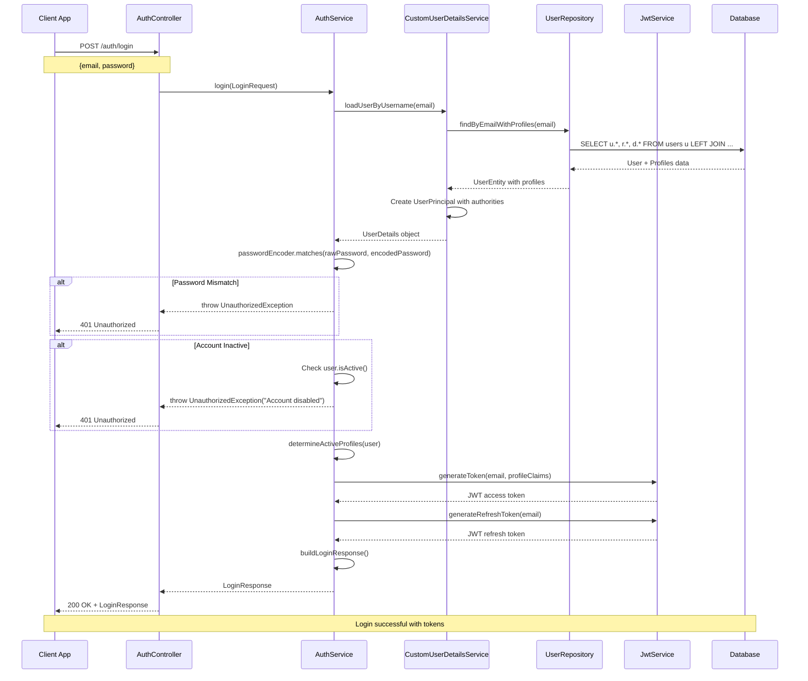

### Multi-Profile Login Claims

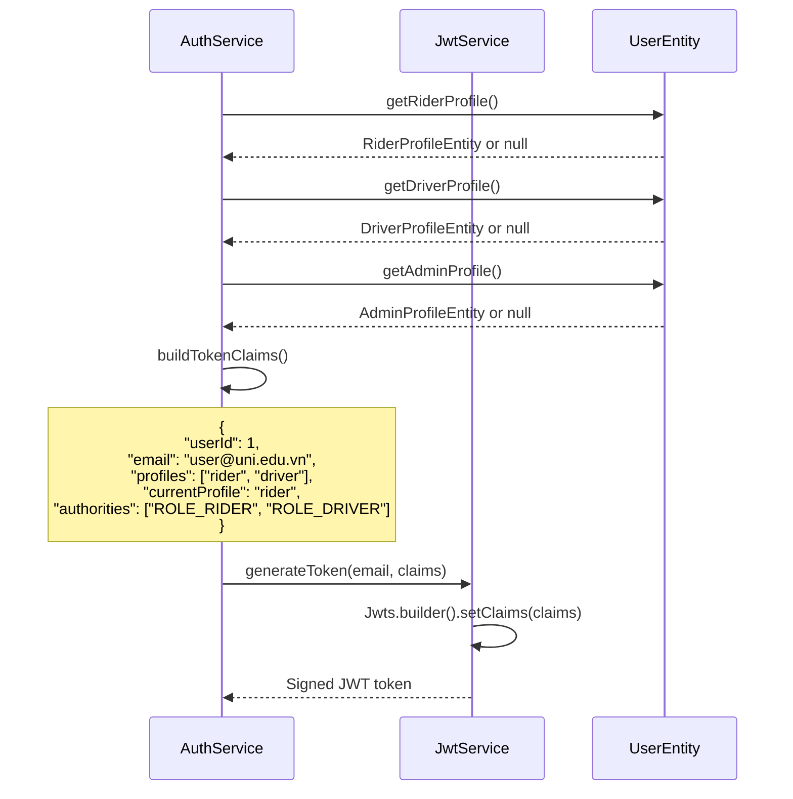

---

## 3. Profile Management Flow

### Get User Profile

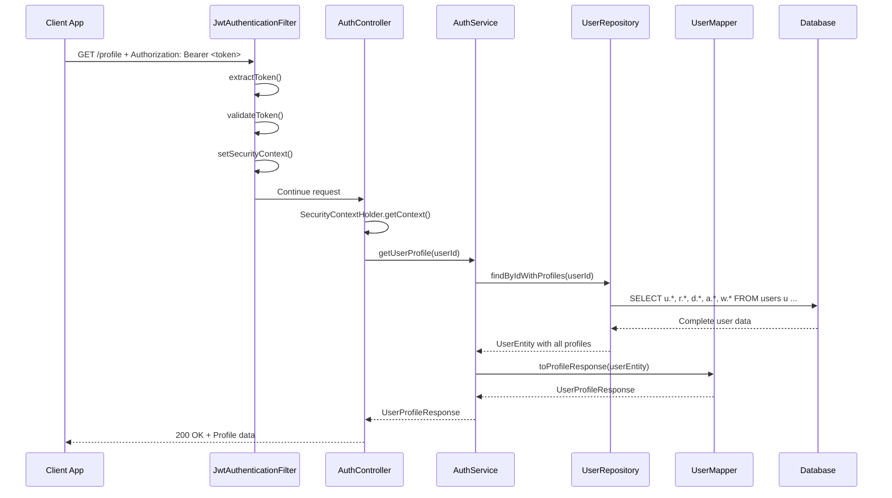

### Switch Profile (Rider to Driver)

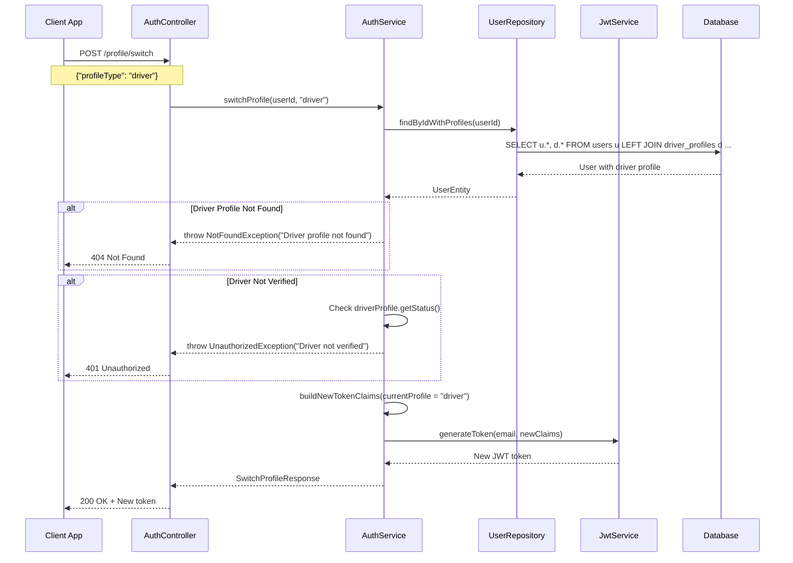

---

## 4. Password Management Flow

### Change Password

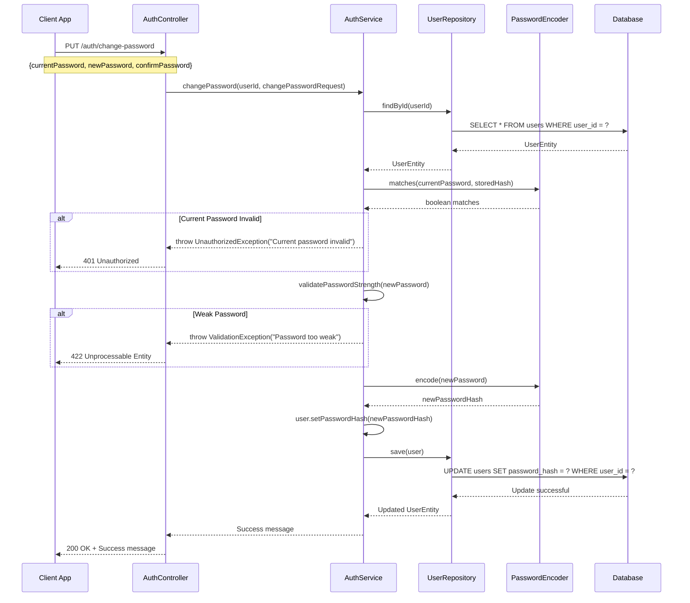

### Forgot Password Flow

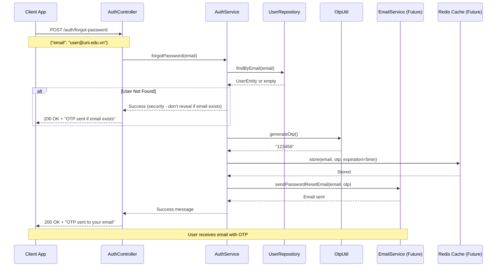

---

## 5. Driver Verification Flow

### Submit Driver Documents

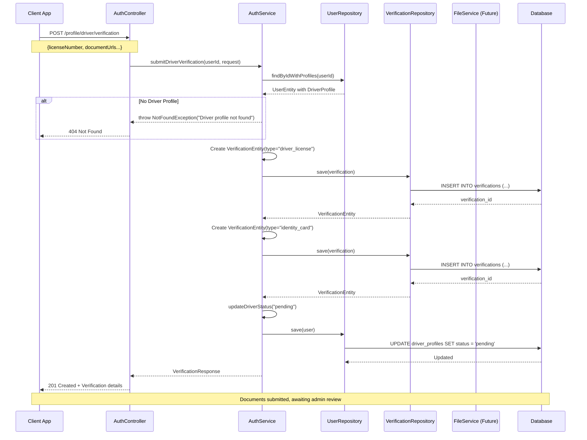

### Admin Review Process

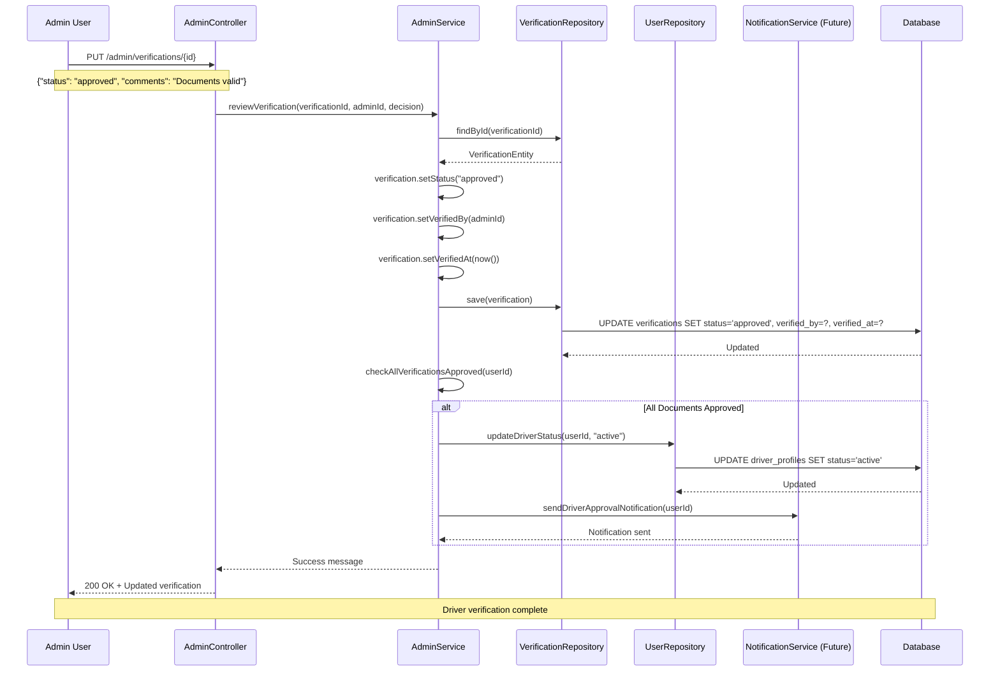

---

## 6. OTP Verification Flow

### Request and Submit OTP

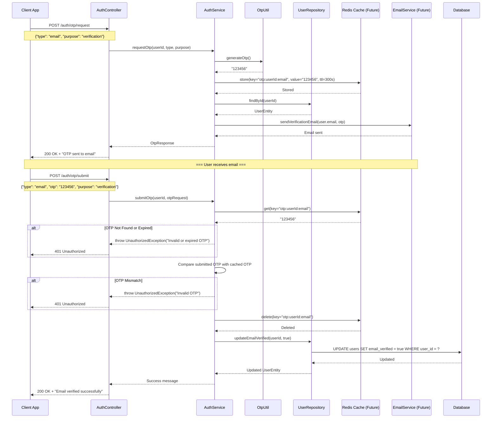

---

## 7. JWT Token Validation Flow

### Request Authentication

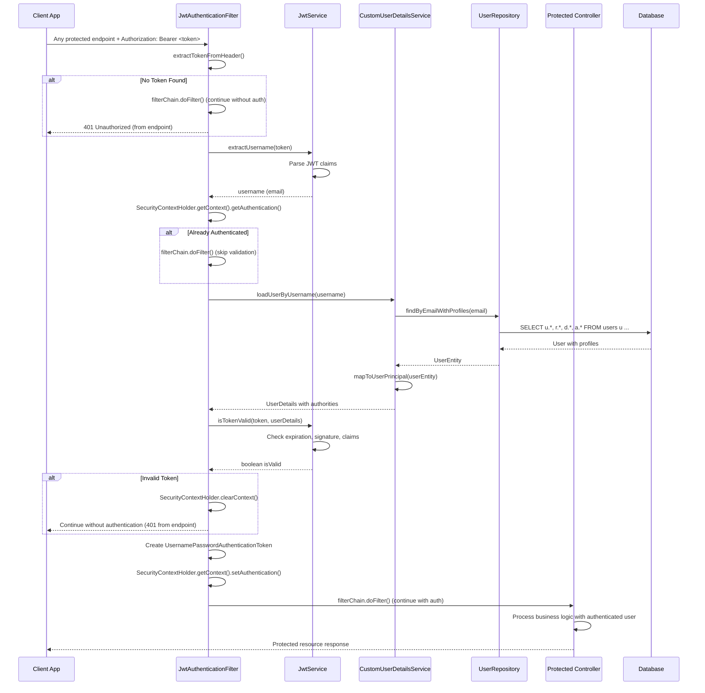

---

## 8. Error Handling Flow

### Global Exception Handling

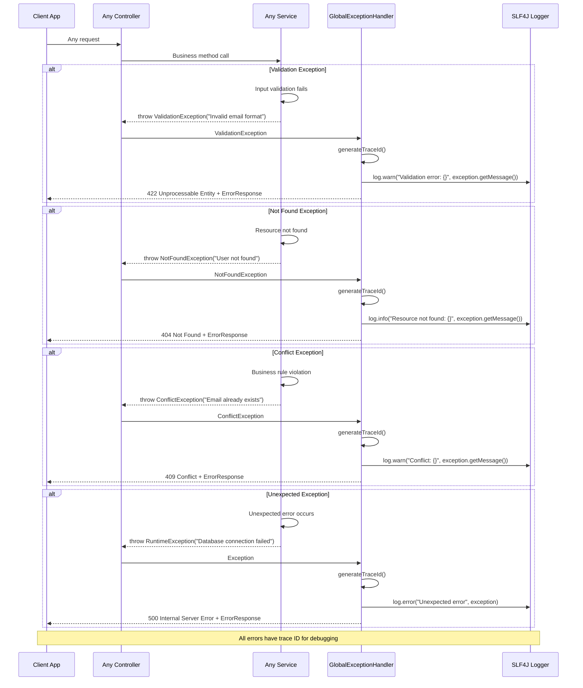

---

## Summary

These sequence diagrams illustrate:

**✅ Complete User Journeys**:
- Registration with automatic profile creation
- Login with multi-profile token generation
- Profile management and role switching
- Document verification workflow

**✅ Security Flows**:
- JWT token validation and refresh
- Password change and reset processes
- OTP generation and verification
- Multi-layer authentication

**✅ Error Handling**:
- Comprehensive exception handling
- Graceful degradation patterns
- Consistent error response format
- Proper logging and traceability

**✅ System Integration**:
- Controller → Service → Repository flow
- Database transaction management
- External service integration patterns
- Caching and performance optimization

These flows ensure the system handles both happy path and error scenarios while maintaining security, performance, and user experience standards.
